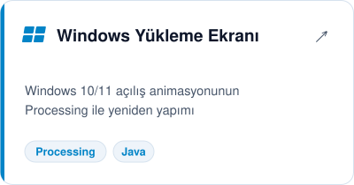
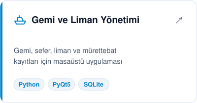
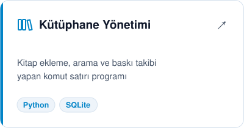
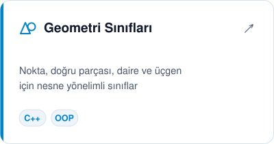

<picture>
  <source media="(prefers-color-scheme: dark)" srcset="assets/banner-dark.svg">
  
</picture>

 

Python, C++ ve Java ile masaüstü uygulamaları, veritabanı projeleri ve animasyonlar geliştiriyorum. Şu sıralar mobil uygulama üzerinde çalışıyorum.

- 🖥️ Arayüzlü masaüstü uygulamaları (PyQt5)
- 🗄️ SQLite ile veritabanı tasarımı
- 🎨 Processing ile görsel programlama ve animasyon
- 📱 Mobil uygulama geliştirme

## 🛠️ Teknolojiler

  

## 🚀 Projeler

<a href="https://github.com/yusufky56/windows-yukleme-ekrani"><picture><source media="(prefers-color-scheme: dark)" srcset="assets/windows-yukleme-ekrani-dark.svg"></picture></a>
<a href="https://github.com/yusufky56/gemi-liman-yonetimi"><picture><source media="(prefers-color-scheme: dark)" srcset="assets/gemi-liman-yonetimi-dark.svg"></picture></a>

<a href="https://github.com/yusufky56/kutuphane-yonetimi"><picture><source media="(prefers-color-scheme: dark)" srcset="assets/kutuphane-yonetimi-dark.svg"></picture></a>
<a href="https://github.com/yusufky56/cpp-geometri-siniflari"><picture><source media="(prefers-color-scheme: dark)" srcset="assets/cpp-geometri-siniflari-dark.svg"></picture></a>

## 🎬 Öne çıkan

  
   
  Windows 10/11 açılış ekranı, Processing ile sıfırdan

